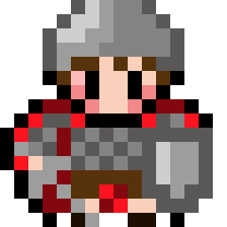

# generally-lua
lua modules
## e
[some random lines](https://foko.w3spaces.com/)

<link rel="stylesheet" type="text/css" href="styles/gen_style.css" /> 
<html>
  <head>
    <meta charset="UTF-8">
    <title>Generator</title>
  </head>
  <body>
    </img>
    <button onclick="Redirect()" class="button">Wróć</button>
    <button onclick="Engine1()" class="button">Wygeneruj (Kraj)</button>
    <button onclick="Engine2()" class="button">Wygeneruj (Świat)</button>
    Wygenerowane: 
<right>Limity:
	Generowane jest maksymalnie 2500 znaków tekstu, Teksty są wybierane z niewielkiej puli przez co mogą się powtarzać, Teksty są wybierane przez Sztuczną Inteligencję przez co jest szansa na wyświetlenie reklamy, istnieje też szansa na błąd prez który tekst nie zostanie wygenerowany</right>

    
	
	
 

  </body>
</html>

